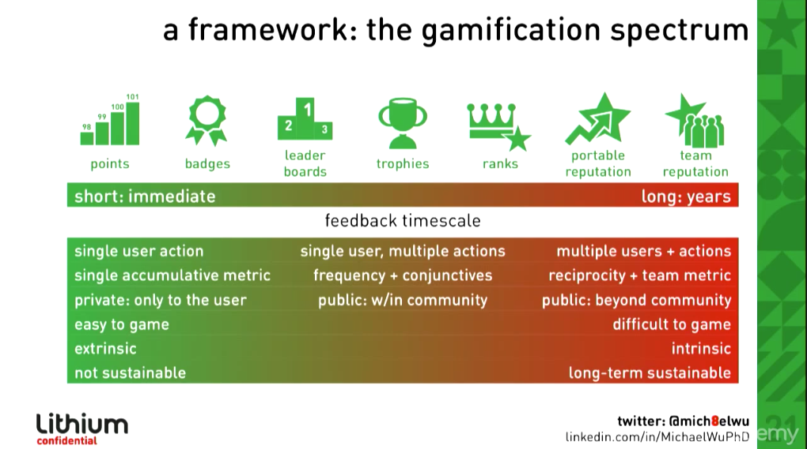
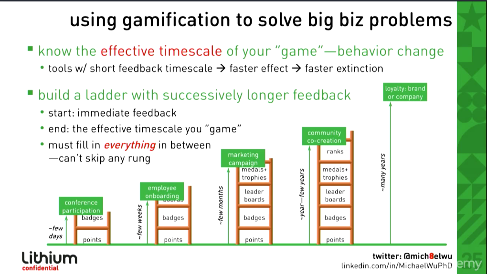

## Introduction

In this post, I'm going to introduce the basics of gamification as discussed in Gabe Zichermann's 2010 talk, "Fun is the Future" and explore the material presented in his Gamification course on Udemy (Level 1). I'll also dig into why it's relevant -- now more than ever -- to know about it.

## Diablo III & Me: Games

I love games. I waited 10+ years for Diablo III to come out and played it on Switch, after a long haitus of gaming. It was fantastic. I operate as a warrior/paladin and get to slay zombies and other monsters on an epic quest. Whenver I'm gaming, I feel a sense of challenge and accomplishment. I get into flow. I love the time I spend gaming and gain more self-efficacy by doing it. T

hrough gaming, I learned resilience, but that's another story. Bottom line, as Gabe Zichermann points out, games benefit their creators, i.e. the house. The fact is that Diablo III has eaten hours of my life, but I feel grateful for the journey spent gaming. 

On the opposite side of the spectrum, gamification gave birth to the corporate loyalty programs of the 1980s that show the more dishonest side of gaming really directly. For example, the redemption of airline points is not easy or desirable for the airline, yet they give out loyalty points. This loyalty program is not built to deliver the rewards, rather to calculate very specific data about its customers. As a result, this game benefits the creator of the game, namely - in this case - the airline. Ultimately, the creators of Diablo III benefited because I bought their game and played it for hours on end with a satisfying experience. However, I became a more optimistic, joyful person for having played in the first place. 

## Gamification: What's that?

>"Gamification is the use of game mechanics, loyalty, and behavioral economics to engage users."
+ from Gabe Zichermann

We can spot gamification with points, badges, and other tools used for gamification, but ultimately it's use is to leverage the feel of games to produce a desirable outcome.

## Basic Gamification Tools

There are hundreds of tools available for gamiifcation; points, badges, leaderboards, etc. However, some are better at long-term cooperation than others. Initially, it's best to have quick feedback via points and a solo level of play to reinforce the game and structure. Depending on how long you want the game to last, this could be enough to gamify a process. If you want a long term game, however, then you'll need to build a ladder where each rung on that ladder is a little bit more difficult than the one before, enhancing the skill level of the player, as well as providing more challenges to keep flow. In the long term, it is best to have players rated on their responses to other players and team reputations on the line. This creates a long-term coop that cares about each other collectively and incentivizes -- through socialization -- the continued play of the game. So, if you want to gamify a conference (2-3 days), use points. To gamify loyalty, it's a longer game. It may take years and therefore, you should use longer term gaming strategies such as the multiplayer co-op model. Here is what Michael Wu suggests: 

The above graphic serves as a basic guide as to when to implement different strategies and how they may be employed and how difficult they are to game. Here is how one may construct a ladder, regarding different circumstances:

As you can see, the longer the game, the more rungs needed on the ladder in order to accomplish the goal.

## Engagement Metrics: Need for Integration

Increasingly, the startup metrics of DAU/MAU (Daily Active Users / Monthly Active Users) are not good measurements of engagement in a product, much less a game. They aren't holistic and only point to when the user is on the site. What does this have to do with gamification? Engagement is the key metric for any product, including games, these days; it's core to have a long-term relationship with your users. Instagram, Facebook, etc. all have methods of engaging users continuously throughout their lifecycle of the their product.

Whether through notifications, likes, or a leaderboard, they deliver the challenge, achievement, and reward cycle commonly seen in games. This releases a bit of dopamine for the user and keeps them on the application for a longer period of time, experiencing eustress.

Zichermann cites a study that shows 80% of people use a second screen on top of TV/streaming screens, as if they need a distraction from the distraction (TV/streaming). There is no reason to believe this trend has receded in the present either. This translating to web applications means that people's attention span is less than 10 seconds of focused time to figure out what a website does, and whether or not they want to use it.

There is a need to integrate not only DAU/MAU into consideration for startups or crypto projects, rather also the entire journey of the user from use or churn, which is why tools like HeatMap have taken off. 

## Why This Is Important

This is important because increasingly engagement dictates who is 'successful' and who is not; who captures their user's attention and who churns. Attention translates to money. Money translates to successful businesses/web applications.

So, it is important that web application developers are aware of game mechanics because their company/client may ask them to build in badges to user profiles - for example - without a larger context of why the badges and how they are distributed. This is NOT proper gamification.

Technically, this may not be difficult to add a badge by itself to a web app, however, if the client/company wants to achieve the potential >30% increase in key engagement metrics, then they will need to be aware that there is more to it than just having a badge on a site. They will need to know the overall cycle of how to create challenge-achievement-reward cycles that are easily completed to rope in users on on-boarding.

## Synthesis: 'Fun is the Future', so is Crypto

I'm a big believer in crypto's, specifically Ethereum's, ability to convert our usual zero-sum game into prosocial, net-positive collaborations. We, as a community, need to be extra careful about the games we are building with tokens embedded in commmunities to ensure the healthy mutual gain of both user and creator. Flipping 'the house always wins' on it's head to the house perhaps always overlaps with user wins, creating win-win games.

The house needs to be built differently than previous models, in order to be successful in today's environment. We need prosocial, long-game, collaborative organizations to facilitate the future of trustless cooperation between diverse stakeholders, customers, and partners. These softer skills of community building interweave with game mechanics in ways that are commonly overlooked or covered by engineering tokens, but gamification goes beyond just tokens. It's about how to reward, when to reward, when to challenge, and, most importantly, how to make dApps fun!

Ethereum has a huge potential to reorganize society as a whole with widespread adoption. It is our responsibility to build a future we want to engage in for the long term. With game mechanics and incorporating alignment of incentives, we can build a more inclusive, sustainable future.

## Conclusion

Someone once said to me that "If you're not playing your own game, you're playing someone else's". This is more true today I believe than the more than 10 years ago it was said to me. Keep that in mind moving on your own quests and make sure to setup yourself up to play prosocial games with others in mind, maximizing for long term relationships.

I look forward to finishing the Gamification Level 1 class today on Udemy. Check it out <a href="https://www.udemy.com/course/designing-gamification-level-1-certification/">here</a>, if you'd like to take it too.